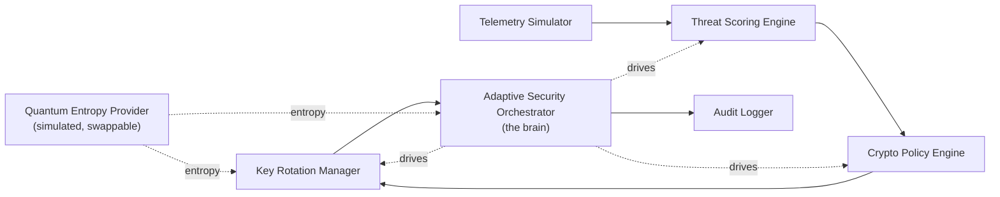

# MARVIN

**Modular Adaptive Reasoning, Vision, and Intelligence Nucleus**

MARVIN is an *adaptive cybersecurity simulation* prototype. It models the
decision logic of an AI-driven cryptographic orchestration system: it observes
changing communication conditions, scores risk, reasons over security posture,
selects cryptographic policies, rotates simulated keys, applies a protection
posture, and logs every decision so the whole lifecycle is auditable.

```
Observe → Score → Reason → Select Policy → Rotate Keys → Apply Posture → Log Decision → Continue Monitoring
```

---

## What MARVIN is

- A **clean, extensible Python simulation** of adaptive cryptographic orchestration.
- A demonstration of **moving-target defense**: posture and keys change as risk changes.
- An **explainable** system: every risk score and policy decision carries reasons.
- A **testable, modular** architecture suitable for technical review and patent storytelling.
- A **provider-pluggable** design: the entropy source is an interface that can later
  be replaced by a real Quantum Random Number Generator (QRNG) API.

## What MARVIN is **not**

- **Not** production quantum cryptography. It does **not** implement QKD hardware behavior.
- **Not** real or regulated security infrastructure.
- **Not** performing real encryption. The "policies" and "keys" are *simulated descriptors*
  used to model decision logic, not cryptographic operations.
- **Not** making any security guarantee beyond simulation.

The "quantum entropy" is explicitly labelled `SIMULATED_QUANTUM_INSPIRED` and is
produced from Python's seedable PRNG for reproducibility — it is **not** certified
randomness.

---

## Architecture overview

MARVIN is organised as a pipeline of small, single-responsibility components
coordinated by a central orchestrator (the "brain"). Telemetry flows in, an
explainable decision flows out, and an audit event is written every tick.



The orchestrator consumes one `TelemetrySnapshot` per tick, asks the scoring
engine for an explainable `ThreatScore`, asks the policy engine for a
`CryptoPolicyDecision`, asks the key manager whether to rotate / quarantine,
updates the live `PostureState`, and writes an `AuditEvent`.

---

## Module responsibility table

| Module | Class | Responsibility |
| --- | --- | --- |
| `marvin/telemetry/simulator.py` | `ThreatTelemetrySimulator` | Generate changing network/security telemetry (baseline, spikes, scenarios, seeded). |
| `marvin/telemetry/scenarios.py` | `ScenarioProfile` | Bias profiles for named scenarios (credential stuffing, interception, etc.). |
| `marvin/entropy/provider.py` | `QuantumEntropyProvider` | Produce *simulated* entropy packets, nonces, and rotation jitter (swappable QRNG). |
| `marvin/scoring/threat_scoring_engine.py` | `ThreatScoringEngine` | Convert telemetry into an explainable, tunable weighted risk score. |
| `marvin/policy/crypto_policy_engine.py` | `CryptoPolicyEngine` | Select an adaptive crypto policy and explain why; apply escalation overrides. |
| `marvin/keys/key_rotation_manager.py` | `KeyRotationManager` | Simulate session-key lifecycle: create, rotate, expire, invalidate, track lineage. |
| `marvin/orchestration/adaptive_security_orchestrator.py` | `AdaptiveSecurityOrchestrator` | The brain: run one full decision cycle per tick and update posture. |
| `marvin/audit/logger.py` | `AuditLogger` | Write structured JSONL + console audit trail of every decision. |
| `marvin/simulation/runner.py` | `SimulationRunner` | Run normal / seeded / scenario / multi-session simulations. |
| `marvin/cli.py` | — | Command-line entry point (`python -m marvin ...`). |
| `marvin/domain/models.py`, `enums.py` | dataclasses / enums | Strongly-typed shared models and vocabulary. |

---

## Setup

Requires **Python 3.11+**.

```bash
# from the repository root
pip install -e .            # core (includes rich for nicer CLI output)
pip install -e ".[dev]"     # add pytest for the test suite
pip install -e ".[dashboard]"  # optional Streamlit dashboard deps
```

---

## CLI examples

```bash
# Calm baseline session
python -m marvin simulate --scenario LOW_RISK_NORMAL_OPERATION --ticks 10

# A suspected man-in-the-middle escalation
python -m marvin simulate --scenario SUSPECTED_INTERCEPTION --ticks 15

# A multi-stage attack chain, deterministic via seed
python -m marvin simulate --scenario CRITICAL_ATTACK_CHAIN --ticks 20 --seed 42

# Machine-readable output + an audit log file
python -m marvin simulate --scenario CREDENTIAL_STUFFING --ticks 12 --seed 1 \
    --json --jsonl audit.jsonl

# Several randomized sessions
python -m marvin multi --sessions 4 --ticks 8 --seed 10

# List available scenarios
python -m marvin scenarios
```

Each tick shows: tick number, threat level, telemetry highlights, selected
policy, key action, and an explanation.

---

## Example output

```
$ python -m marvin simulate --scenario SUSPECTED_INTERCEPTION --ticks 12 --seed 7

  Tick   Risk       Score   Telemetry highlights              Policy                  Key action
     1   HIGH        0.56   anomaly=0.49 trust=0.56 ...        HYBRID_POST_QUANTUM…    rotate
     2   CRITICAL    0.81   anomaly=0.88 failed_auth=11 ...    SESSION_QUARANTINE      QUARANTINE
     3   CRITICAL    1.00   ...                                SESSION_QUARANTINE      QUARANTINE
   ...

tick 1 REQUIRE_REAUTHENTICATION :: Risk HIGH (score 0.56, confidence 0.84).
  Why: Suspected interception flagged on the channel.; High data sensitivity (CONFIDENTIAL).;
  High adversary pressure (0.74). Policy HYBRID_POST_QUANTUM_MODE — HIGH risk: engage hybrid
  post-quantum mode and require reauth. Keys: Initial session key established.
tick 2 QUARANTINE_AND_INVESTIGATE :: Risk CRITICAL (score 0.81 ...) Policy SESSION_QUARANTINE
  — CRITICAL risk; suspected interception under CRITICAL risk: quarantine session.
  Keys: Session quarantined: active key invalidated.
```

MARVIN detects rising risk, explains it, escalates the crypto policy, rotates
(then invalidates) keys, logs every decision, and continues adapting.

---

## Optional dashboard

A lightweight [Streamlit](https://streamlit.io) dashboard visualises risk over
time, policy selection over time, key rotations, and the audit trail:

```bash
pip install -e ".[dashboard]"
streamlit run dashboard/app.py
```

---

## Running tests

```bash
pip install -e ".[dev]"
python -m pytest -q
```

The suite proves the key behaviours: low-risk telemetry selects the standard
policy, medium risk increases rotation frequency, suspected interception
escalates protection, a critical attack chain triggers quarantine, high data
sensitivity raises protection, key rotation creates a new active key, the audit
logger records every decision, the orchestrator returns explainable snapshots,
and seeded simulations are repeatable.

---

## Patent demonstration value

MARVIN demonstrates a concrete, working model of **AI-driven adaptive
cryptographic orchestration**:

- **Dynamic policy selection** based on live, scored risk rather than static configuration.
- **Moving-target defense** via posture changes and key rotation as conditions evolve.
- **Explainable decisions** — every change is justified by named reasons and rationale.
- **A replaceable quantum entropy provider** modelling future QRNG integration.
- **Complete, replayable audit logs** suitable for SIEM-style ingestion.

See [`docs/patent_demo_notes.md`](docs/patent_demo_notes.md) for the full write-up.

---

## Future roadmap

- Replace `QuantumEntropyProvider` with a real **QRNG API** client.
- Integrate genuine **post-quantum** primitives (e.g. ML-KEM / hybrid TLS).
- Bind simulated keys to a real **HSM / KMS**.
- Stream audit events to a real **SIEM**.
- Couple posture decisions to a **zero-trust identity** provider for step-up auth.
- Replace the weighted-sum scorer with a learned risk model while preserving explainability.
- Multi-session, multi-tenant orchestration with shared threat intelligence.

---

## Documentation

- [`docs/architecture.md`](docs/architecture.md) — component and data-flow detail.
- [`docs/patent_demo_notes.md`](docs/patent_demo_notes.md) — demonstration value and extension points.
- [`docs/threat_model.md`](docs/threat_model.md) — simulated threats, scenarios, and scope.

## License

MIT (prototype / demonstration use).
