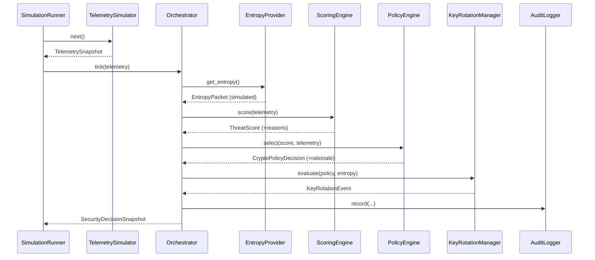

# MARVIN Architecture

This document describes MARVIN's components, the data that flows between them,
and the per-tick decision lifecycle in more detail than the README.

## Design philosophy

- **Modular** — each stage is a small class with one responsibility.
- **Explainable** — scores and policy choices carry human-readable reasons.
- **Testable** — deterministic via seeds; pure functions where practical.
- **Extensible** — providers and engines are swappable behind clear interfaces.
- **Demo friendly** — a single CLI command tells a complete story.
- **Honest** — nothing claims to be real cryptography or quantum hardware.

## The lifecycle

Every simulation tick runs the same cycle inside
`AdaptiveSecurityOrchestrator.tick()`:

1. **Observe** — `ThreatTelemetrySimulator.next()` yields a `TelemetrySnapshot`.
2. **Entropy** — `QuantumEntropyProvider.get_entropy()` yields an `EntropyPacket`
   (simulated; feeds key material and moving-target rotation jitter).
3. **Score** — `ThreatScoringEngine.score()` returns an explainable `ThreatScore`
   with a `numeric_score`, `risk_level`, `reasons`, `recommended_action`, `confidence`.
4. **Reason / Select** — `CryptoPolicyEngine.select()` returns a
   `CryptoPolicyDecision`, applying escalation overrides for strong signals.
5. **Rotate** — `KeyRotationManager.evaluate()` decides whether to establish,
   rotate, hold, or invalidate (quarantine) the session key, returning a
   `KeyRotationEvent`.
6. **Apply Posture** — the orchestrator updates the live `PostureState`.
7. **Log** — `AuditLogger.record()` writes one `AuditEvent`.
8. **Return** — a readable `SecurityDecisionSnapshot` is returned to the caller.

## Components

### ThreatTelemetrySimulator (`telemetry/`)
Generates per-tick telemetry biased by a `ScenarioProfile`. Escalating scenarios
ramp risk indicators upward over the first ~10 ticks to model an unfolding
attack; random "spikes" perturb a single tick. A seeded `random.Random` makes
runs fully reproducible. Scenarios: `LOW_RISK_NORMAL_OPERATION`,
`CREDENTIAL_STUFFING`, `SUSPECTED_INTERCEPTION`, `HIGH_VALUE_DATA_TRANSFER`,
`DEGRADED_NETWORK`, `CRITICAL_ATTACK_CHAIN`.

### QuantumEntropyProvider (`entropy/`)
Produces `EntropyPacket`s (hex entropy, source label, simulated confidence,
timestamp), nonces, and jittered rotation intervals. The `EntropyProvider`
`Protocol` defines the surface a real QRNG backend would implement, so the
simulator can be swapped without touching downstream code.

### ThreatScoringEngine (`scoring/`)
Transparent weighted-sum model. Each signal is normalised to 0..1, multiplied by
a tunable weight (`ScoringWeights`), and summed/normalised into a 0..1 score that
maps onto `LOW/MEDIUM/HIGH/CRITICAL`. Suspected interception floors risk at
`HIGH`. Every contributing signal is recorded as a reason. Confidence decreases
when the network is degraded (noisier signals).

### CryptoPolicyEngine (`policy/`)
Maps risk level to a base policy, then applies overrides:
- Suspected interception → escalate to at least hybrid PQC (quarantine if CRITICAL).
- Collapsed trust / extreme adversary pressure at CRITICAL → quarantine.
- Restricted data → raise protection floor and tighten rotation.
- Degraded network at low/medium risk → prefer low-latency ChaCha20-Poly1305.

### KeyRotationManager (`keys/`)
Simulated key lifecycle with lineage (`lineage_parent_key_id`). Rotation triggers
(in priority order): quarantine → no key yet → explicit rekey → policy change →
expiry. Quarantine invalidates the active key and clears it.

### AdaptiveSecurityOrchestrator (`orchestration/`)
The brain. Coordinates all engines, maintains `PostureState`, and is *fail-safe
sticky*: once a session is quarantined it stays quarantined (subsequent ticks are
still audited) until manual re-onboarding.

### AuditLogger (`audit/`)
Stores `AuditEvent`s in memory, optionally appends JSON-lines to a file, and can
echo a compact console line. `export()` returns JSON-friendly dicts.

### SimulationRunner (`simulation/`)
Wires telemetry + entropy + orchestrator together for N ticks. Supports single
sessions (normal/seeded/scenario) and randomized multi-session runs. Derives
independent-but-reproducible seeds for telemetry vs entropy from a single seed.

## Data models (`domain/models.py`)

All models are `dataclasses` with a `to_dict()` that recursively serialises
datetimes and enums, so any artefact can be written straight to JSON.
