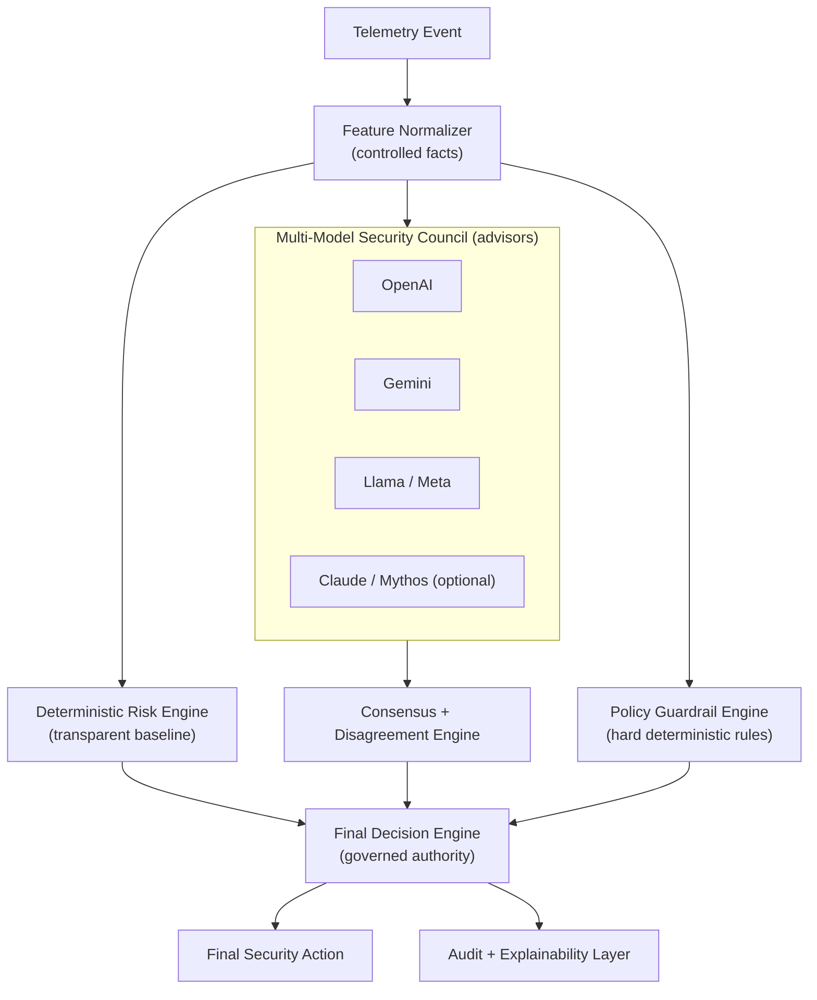

# MARVIN Multi-Model Security Council

> **Core principle: LLMs advise; MARVIN governs.** Multiple independent
> reasoning engines interpret the same telemetry and return structured
> recommendations. A deterministic governance + decision engine — never the
> models — selects the final security action.

This is a security *council*, not a free-for-all. Models help interpret
ambiguity; hard rules enforce the floor. No quartet of models can vote MARVIN
into a bad action, and no single model can unilaterally escalate one.

## Pipeline



## The shared recommendation schema

Every advisor receives the *same* controlled facts and returns the *same* schema:

```json
{
  "risk_level": "HIGH",
  "recommended_policy": "QUANTUM_ESCALATED_MODE",
  "requires_key_rotation": true,
  "requires_reauthentication": true,
  "requires_quarantine": false,
  "reasoning_summary": "Suspicious geo-velocity, failed-auth burst, and suspected interception indicate elevated compromise risk.",
  "confidence": 0.86
}
```

## Advisors (`marvin/advisors/`)

| Advisor | Vendor | Offline persona | Online backend |
| --- | --- | --- | --- |
| `OpenAIAdvisor` | OpenAI | Balanced, structured; tracks the baseline, favours rotation. | OpenAI Structured Outputs (`OPENAI_API_KEY`). |
| `GeminiAdvisor` | Google | Conservative/agentic; weighs geo-velocity & interception, escalates a band. | Google GenAI JSON mode (`GEMINI_API_KEY`). |
| `LlamaAdvisor` | Meta | Open-weight, balanced; weighs auth bursts, favours reauth + rotation. | OpenAI-compatible endpoint (`LLAMA_BASE_URL`). |
| `ClaudeAdvisor` | Anthropic | Security-specialized, conservative; weighs interception & trust collapse. | Anthropic Messages API (`ANTHROPIC_API_KEY`). |

**Offline first.** Every advisor ships a deterministic, seedable persona built
on a re-tuned copy of MARVIN's own scorer, so the entire council runs with **no
network access** (the default, and what the test-suite uses). Setting
`online=True` opts into a real API call; if the SDK or credentials are missing,
the advisor degrades gracefully to its offline persona and records the error in
`source` / `error`.

> **On "Mythos".** Reports describe Mythos as a cybersecurity-specialized
> Anthropic model, but access appears restricted and sourcing is unconfirmed.
> MARVIN therefore treats Claude/Mythos as **optional** — offline by default,
> live only when an Anthropic key is configured.

## Consensus (`marvin/consensus/`)

* `RecommendationAggregator` — counts risk/policy/action votes and derives the
  `majority_risk_level`, `max_risk_level`, and the **`escalation_risk_level`**:
  the most severe band supported by at least *N* advisors (default 2). A lone
  alarmist cannot move the action.
* `DisagreementDetector` — measures the risk-level spread, detects quarantine
  splits, highlights a lone escalator that may have *caught something others
  missed*, and decides when divergence warrants **human review**.

## Governance (`marvin/governance/`)

* `PolicyGuardrails` — deterministic hard rules evaluated purely from telemetry
  (never from model output). Examples:
  * `INTERCEPTION_ON_SENSITIVE_DATA` — suspected interception + RESTRICTED/
    MISSION_CRITICAL data ⇒ inaction forbidden, quarantine eligible, floor HIGH.
  * `COLLAPSED_TRUST_UNDER_PRESSURE` — trust ≤ 0.2 with pressure ≥ 0.8 ⇒
    **mandatory** quarantine.
  * `AUTH_BURST`, `MISSION_CRITICAL_DATA`, `REPEAT_INCIDENT_HISTORY`.
* `escalation_rules` — pure helpers for conservative policy mapping and audit
  severity.

## Final decision (`marvin/consensus/final_decision_engine.py`)

Authority order:

1. **Guardrails are absolute** (floor risk, mandate/forbid actions).
2. **Deterministic baseline is the floor** — the final risk is never below
   MARVIN's own transparent score.
3. **The council may escalate, not weaken** — only with ≥ 2 supporting advisors.
4. **Conservative on disagreement** — splits take the safer action *and* flag
   human review. Quarantine (the most disruptive action) needs a *strict*
   majority or a mandatory guardrail.

The output `CouncilDecision` carries the final risk, policy, action flags, audit
severity, a `human_review_required` flag, every advisor recommendation, the
consensus and disagreement reports, and the guardrail verdict — fully auditable.

## Worked example (the headline scenario)

Controlled facts: `failed_auth=9, trust=0.42, geo=0.87, RESTRICTED, interception=true, packet loss elevated`.

| Source | Verdict |
| --- | --- |
| MARVIN baseline | HIGH |
| OpenAI | HIGH, rotate key |
| Gemini | CRITICAL, quarantine |
| Llama | HIGH, reauth + rotate |
| Claude/Mythos | CRITICAL, quarantine |
| Consensus | elevated concern; 2 escalate / 2 quarantine |
| Guardrail | interception + restricted data ⇒ quarantine *eligible* |
| **Final MARVIN action** | **QUANTUM_ESCALATED_MODE**, key rotation + reauth, **flagged for human review** |

> *"Multiple independent reasoning engines evaluated this event. Two recommended
> quarantine, two recommended escalation. Because restricted data and suspected
> interception were present, MARVIN selected the conservative security posture."*

Reproduce it:

```bash
python -m marvin council --demo
python -m marvin simulate --scenario SUSPECTED_INTERCEPTION --ticks 12 --seed 7 --council
```

## Why this is differentiated

A single-model system is one opinion. MARVIN triangulates several independent
reasoning engines, **measures their disagreement**, and subordinates all of them
to transparent, testable rules. That is defensible in a boardroom *and* in an
engineering review: the models add interpretation of ambiguity; the deterministic
core keeps control.
